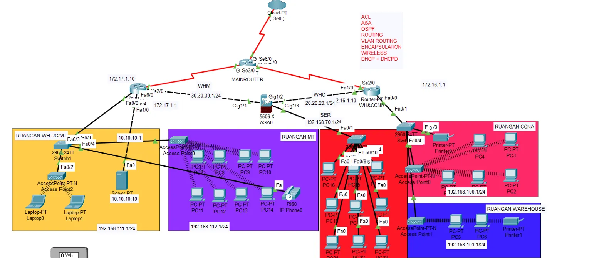

# Enterprise Multi-Site Network Infrastructure

## Overview
This repository contains a comprehensive enterprise network design implementing advanced routing protocols, security features, and multi-site connectivity. The network demonstrates real-world enterprise architecture with WAN connectivity, multiple campus locations, wireless infrastructure, and layered security.



## Network Architecture

### Core Components
- **Main Router (WHM)** - Primary WAN aggregation and routing
- **Secondary Router (WHC)** - Redundant WAN connectivity  
- **Secure Router (SER)** - Security edge router with ASA0 firewall
- **Cloud Connection** - Internet/ISP connectivity via Se0/0

### Site Locations

#### 1. **RUANGAN WH RC/MT** (Yellow Zone - Main Office)
- **Network**: 192.168.111.1/24
- **Subnet**: 10.10.10.1
- **Equipment**:
  - 2960-24TT Switch1
  - Server-PT (10.10.10.10)
  - Access Point-PT-N (Access Point2)
  - 2 Laptop endpoints (Laptop0, Laptop1)

#### 2. **RUANGAN MT** (Purple Zone - Marketing/IT)
- **Network**: 192.168.112.1/24
- **Equipment**:
  - Access Point-PT-N (Access Point3)
  - Multiple PC endpoints (PC-PT PC7-PC14)
  - IP Phone0 (7960)
  - Wireless connectivity for mobile users

#### 3. **RUANGAN CCNA** (Red Zone - Training/Lab)
- **Network**: 192.168.100.1/24
- **Equipment**:
  - 2960-24TT Switch (central)
  - Multiple switches (PC-PT PC15-PC19)
  - Access Point-PT-N (Access Point1, Access Point0)
  - Printer-PT infrastructure
  - PC endpoints (PC-PT PC2, PC3, PC4)

#### 4. **RUANGAN WAREHOUSE** (Blue Zone - Storage/Operations)
- **Network**: 192.168.101.1/24
- **Equipment**:
  - Access Point-PT-N (Access Point1)
  - PC endpoints (PC-PT PC5, PC6)
  - Printer-PT (Printer1)

## Routing Protocols Implemented

### OSPF (Open Shortest Path First)
- Deployed across core infrastructure
- Area 0 (backbone) configuration
- Fast convergence for internal routing
- Link-state routing for optimal path selection

### VLAN Routing
- Inter-VLAN routing via router-on-a-stick or L3 switching
- Multiple VLANs for network segmentation
- Subnet isolation for security

### Static Routing
- Used for specific routes where needed
- Backup routes configuration
- Default gateway configurations

## Advanced Features Implemented

### 1. Access Control Lists (ACL)
```cisco
! Example ACL configuration
access-list 100 permit ip 192.168.111.0 0.0.0.255 any
access-list 100 deny ip any any
```
Deployed for traffic filtering and security policies


### 2. ASA Firewall (ASA0 on 5506-X)
- Positioned at security perimeter
- Zone-based security
- Stateful packet inspection
- NAT/PAT configuration

### 3. Wireless Network
- Multiple Access Points for coverage
- Centralized management
- Secure authentication (WPA2/WPA3)
- SSID segmentation


### 4. DHCP Services
- Centralized DHCP server (10.10.10.10)
- DHCP pools per VLAN/subnet
- IP address management
- Option 150 for IP phones

### 5. DHCPv6 + DHCPD
- IPv6 addressing support
- Dual-stack configuration
- Stateless/Stateful DHCPv6

### 6. Encapsulation
- 802.1Q VLAN tagging on trunks
- PPP/HDLC on WAN links
- GRE tunnels (if applicable)

## Network Segmentation

### IP Addressing Scheme

| Location | Network | Gateway | VLAN |
|----------|---------|---------|------|
| WH RC/MT | 192.168.111.0/24 | 192.168.111.1 | - |
| MT | 192.168.112.0/24 | 192.168.112.1 | - |
| CCNA | 192.168.100.0/24 | 192.168.100.1 | - |
| Warehouse | 192.168.101.0/24 | 192.168.101.1 | - |
| Core Network | 10.10.10.0/24 | 10.10.10.1 | - |
| WAN Link 1 | 30.30.30.0/24 | - | - |
| WAN Link 2 | 20.20.20.0/24 | - | - |
| SER Connection | 192.168.70.0/24 | 192.168.70.1 | - |
| External WAN | 172.17.1.0/24 | - | - |
| External WAN 2 | 172.16.1.1/24 | - | - |

## WAN Connectivity

### Dual WAN Configuration
- **WHM Router**: Primary WAN connection
  - Serial interfaces (Se2/0, Se3/0)
  - GigabitEthernet connections (Gig1/1, Gig1/2, Gig1/3)
- **WHC Router**: Secondary/backup WAN
  - Redundant connectivity
  - Load balancing capability
  
### Internet Access
- Cloud-PT connection via Se0/0
- Public IP addressing
- NAT/PAT at border


## Security Implementation

### Layered Security Model

**Layer 1: Perimeter Security**
- ASA0 firewall (Cisco ASA 5506-X)
- Edge ACLs on border routers
- DMZ configuration

**Layer 2: Access Security**
- Port security on switches
- 802.1X authentication (if enabled)
- VLAN segmentation

**Layer 3: Network Security**
- ACLs on router interfaces
- Private VLAN implementation
- Anti-spoofing measures

**Layer 4: Application Security**
- Stateful inspection
- Application-layer filtering
- Traffic shaping/QoS


## VoIP Implementation

### IP Telephony Features
- Cisco IP Phone 7960 deployed
- Voice VLAN configuration
- QoS for voice traffic
- DHCP Option 150 for TFTP
- Separate voice and data VLANs

```cisco
interface FastEthernet0/1
 switchport mode access
 switchport access vlan 10
 switchport voice vlan 20
 spanning-tree portfast
```

## Wireless Infrastructure

### Access Point Deployment
- **Access Point2** (WH RC/MT) - Main office coverage
- **Access Point3** (MT) - Marketing/IT area
- **Access Point1** (CCNA + Warehouse) - Lab and warehouse coverage
- **Access Point0** (CCNA) - Additional CCNA lab coverage

### Wireless Security
- WPA2-Enterprise or WPA2-PSK
- MAC filtering (optional)
- Guest network isolation
- Bandwidth management

## Configuration Examples

### OSPF Configuration
```cisco
router ospf 1
 network 192.168.111.0 0.0.0.255 area 0
 network 192.168.112.0 0.0.0.255 area 0
 network 192.168.100.0 0.0.0.255 area 0
 network 192.168.101.0 0.0.0.255 area 0
 network 10.10.10.0 0.0.0.255 area 0
 passive-interface default
 no passive-interface GigabitEthernet0/0
```

### Inter-VLAN Routing
```cisco
interface GigabitEthernet0/0.10
 encapsulation dot1Q 10
 ip address 192.168.111.1 255.255.255.0
 
interface GigabitEthernet0/0.20
 encapsulation dot1Q 20
 ip address 192.168.112.1 255.255.255.0
```

### DHCP Configuration
```cisco
ip dhcp pool VLAN10
 network 192.168.111.0 255.255.255.0
 default-router 192.168.111.1
 dns-server 8.8.8.8
 option 150 ip 10.10.10.10

ip dhcp pool VLAN20
 network 192.168.112.0 255.255.255.0
 default-router 192.168.112.1
 dns-server 8.8.8.8
```

### ASA Firewall Basic Config
```cisco
interface GigabitEthernet1/1
 nameif outside
 security-level 0
 ip address 192.168.70.1 255.255.255.0

interface GigabitEthernet1/2
 nameif inside
 security-level 100
 ip address 192.168.100.1 255.255.255.0

access-list outside_in extended permit icmp any any
access-list outside_in extended permit tcp any any eq 80
access-list outside_in extended permit tcp any any eq 443
```

## High Availability Features

### Redundancy Mechanisms
- Dual WAN connections (WHM and WHC)
- Multiple router paths
- OSPF automatic failover
- Redundant access points
- Multiple switches for distribution

### Backup and Recovery
- Configuration backups
- TFTP server (10.10.10.10)
- Disaster recovery procedures

## Quality of Service (QoS)

### Traffic Prioritization
1. Voice (IP Phone) - Highest priority
2. Critical data - High priority
3. Business applications - Medium priority
4. Guest/Internet traffic - Low priority

```cisco
class-map match-any VOICE
 match ip dscp ef
 
policy-map QOS-POLICY
 class VOICE
  priority percent 30
  
interface GigabitEthernet0/0
 service-policy output QOS-POLICY
```

## Monitoring and Management

### Network Management
- SNMP monitoring
- Syslog server configuration
- NetFlow for traffic analysis
- Remote access via SSH

### Verification Commands
```cisco
show ip interface brief
show ip route
show ip ospf neighbor
show vlan brief
show interfaces trunk
show access-lists
show crypto isakmp sa
show ip dhcp binding
show wireless client
```

## Repository Structure
```
.
├── assets/
│   ├── full-topology.png
│   ├── acl-config.png
│   ├── wan-config.png
│   ├── security-config.png
│   ├── wireless-config.png
│   ├── ospf-config.png
│   ├── dhcp-config.png
│   └── vlan-config.png
├── configs/
│   ├── mainrouter-whm.txt
│   ├── router-whc.txt
│   ├── router-ser.txt
│   ├── asa0-firewall.txt
│   ├── switch1-config.txt
│   ├── switch2-config.txt
│   └── accesspoint-configs.txt
├── documentation/
│   ├── network-design.pdf
│   ├── addressing-plan.xlsx
│   └── security-policy.pdf
└── README.md
```

## Technologies Used

- **Routing Protocols**: OSPF, Static Routes
- **Security**: ACLs, ASA Firewall, Port Security
- **WAN**: Serial connections, GRE tunnels
- **LAN**: VLANs, STP, EtherChannel
- **Wireless**: 802.11n/ac, WPA2, Multiple APs
- **Services**: DHCP, DHCPv6, DNS
- **VoIP**: IP Telephony, QoS
- **Management**: SSH, SNMP, Syslog

## Learning Objectives

This lab demonstrates:
1. Enterprise network design principles
2. Multi-site connectivity and WAN routing
3. Advanced routing protocol implementation (OSPF)
4. Comprehensive security architecture
5. Wireless network deployment
6. VoIP integration and QoS
7. High availability and redundancy
8. Network segmentation and isolation
9. Centralized services (DHCP, DNS)
10. Firewall configuration and management

## Testing Procedures

### Connectivity Tests
```cisco
! Test inter-VLAN routing
ping 192.168.112.1 source 192.168.111.1

! Test OSPF neighbors
show ip ospf neighbor

! Test WAN connectivity
ping 172.17.1.10
ping 172.16.1.1

! Test ACL functionality
show access-lists
show ip access-lists

! Test wireless connectivity
show wireless client summary
```

### Performance Tests
- Bandwidth testing between sites
- Latency measurements
- Voice quality testing
- Failover testing

## Troubleshooting Guide

### Common Issues and Solutions

**Issue**: No connectivity between VLANs
- Check inter-VLAN routing configuration
- Verify VLAN assignments on switch ports
- Check router subinterface configuration

**Issue**: OSPF neighbor not forming
- Verify network statements
- Check interface IP addresses
- Verify area configuration
- Check for ACLs blocking OSPF

**Issue**: DHCP not working
- Check DHCP pool configuration
- Verify ip helper-address on SVIs
- Check DHCP server reachability

**Issue**: Wireless clients cannot connect
- Verify SSID configuration
- Check authentication settings
- Verify AP connectivity to controller

## Best Practices Implemented

✅ **Network Design**
- Hierarchical network model (Core, Distribution, Access)
- Proper IP addressing scheme
- Network segmentation by function

✅ **Security**
- Defense in depth strategy
- ACLs at multiple layers
- Secure management access (SSH only)
- Port security on access ports

✅ **Redundancy**
- Dual WAN connections
- Multiple routing paths
- Redundant access points

✅ **Scalability**
- Modular design
- OSPF for dynamic routing
- Room for growth in each subnet

✅ **Documentation**
- Network diagrams
- IP address documentation
- Configuration standards

## Future Enhancements

Potential additions to consider:
- IPv6 full deployment
- SD-WAN implementation
- Network automation (Python, Ansible)
- Advanced monitoring (PRTG, SolarWinds)
- VPN remote access
- Additional security layers (IPS/IDS)

## Lab Environment

- **Platform**: Cisco Packet Tracer / GNS3 / EVE-NG
- **Routers**: Cisco ISR series
- **Switches**: Cisco Catalyst 2960 series
- **Firewall**: Cisco ASA 5506-X
- **Wireless**: Lightweight APs
- **IP Phones**: Cisco 7960

## Getting Started

1. Review the complete network topology
2. Understand the IP addressing scheme
3. Study the routing configuration
4. Examine security implementations
5. Test connectivity between all sites
6. Verify redundancy mechanisms
7. Document any changes made

## License
Educational/Training purposes

## Contact & Support

For questions or issues with this network design:
- Review the configuration files in `/configs`
- Check the documentation in `/documentation`
- Test using verification commands provided

---
*This enterprise network demonstrates industry-standard design patterns and best practices for multi-site connectivity, security, and high availability.*
